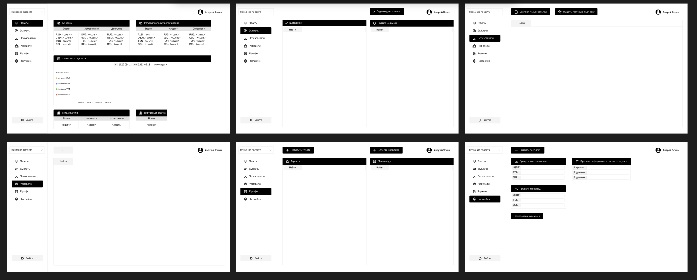

# Название проекта

Админ панель на React.js

## Описание

Этот проект представляет собой админ панель, разработанную для управления основными данными и настроек бизнес логики приложения. Админ панель базируется на ASP.NET Web API, MySQL и использует систему авторизации, основанную на JWT токенах.

## Функциональности

### Авторизация с использованием JWT токенов

Админ панель обеспечивает систему авторизации, используя JWT (JSON Web Token) для аутентификации пользователя. Вход в систему осуществляется с помощью учетных данных пользователя, и после успешной аутентификации выдается JWT токен, который используется для доступа к защищенным разделам админ панели.

### Основные данные

В разделе "Основные данные" собрана общая информация о приложении. Здесь можно просматривать и редактировать основные данные, такие как общая статистика, настройки приложения и другую существенную информацию.

### Редактирование пользователей

В секции "Редактирование пользователей" можно просматривать и управлять пользователями приложения. Эта функциональность включает возможность создания, редактирования и удаления пользователей, а также просмотр дополнительной информации о каждом пользователе.

### Редактирование тарифов и генерация промокодов

Секция "Редактирование тарифов и генерация промокодов" позволяет управлять тарифами приложения. Здесь можно добавлять новые тарифы, редактировать существующие и генерировать промокоды для акций и скидок.

### Настройки

В секции "Настройки" можно настраивать параметры бизнес логики приложения. Здесь предоставляются возможности для настройки различных параметров, таких как лимиты, правила и другие параметры, влияющие на функциональность приложения.

---
